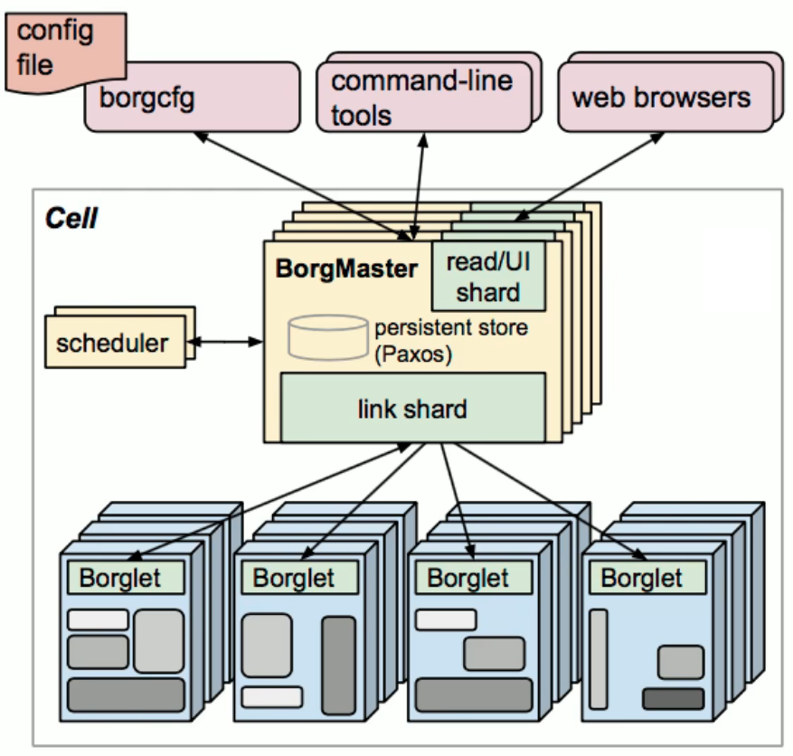
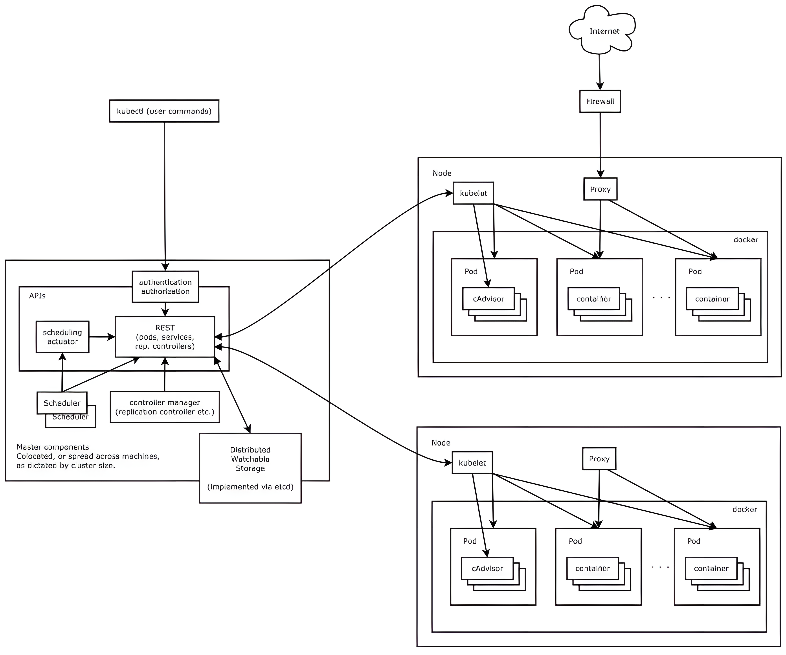
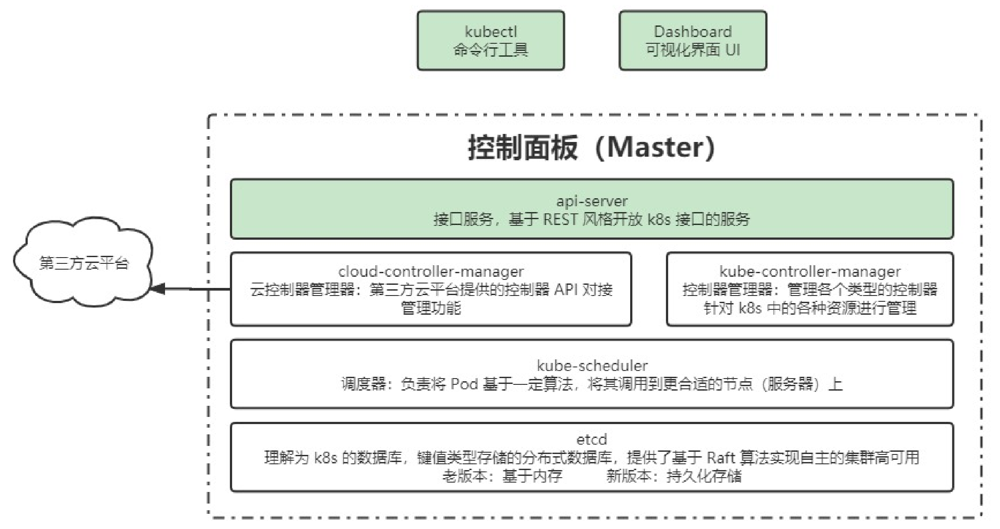
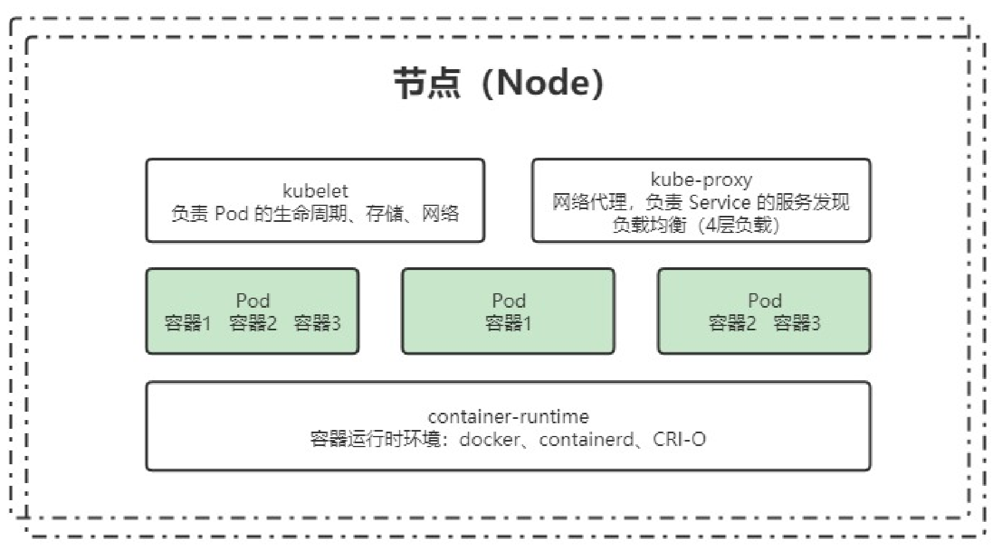
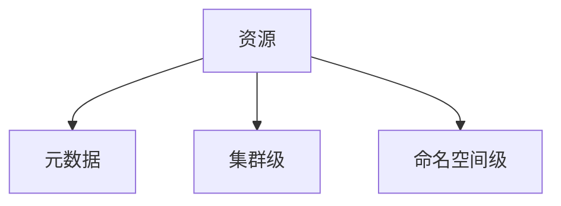
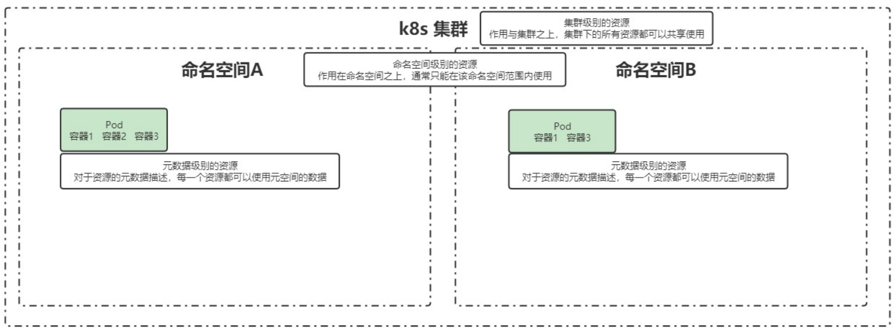
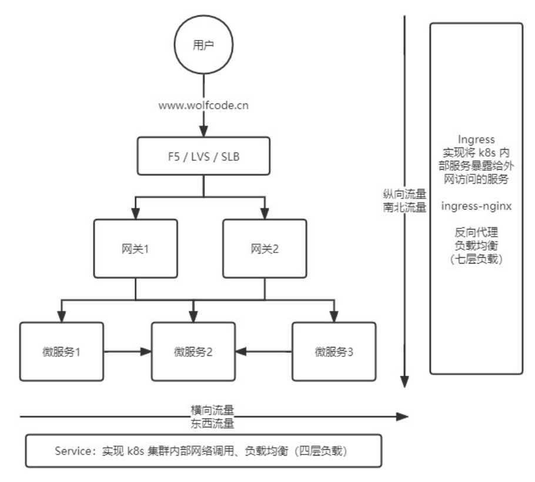

# k8s核心概念

## 认识 Kubernetes

### 什么是 Kubernetes？

**Kubernetes（简称 K8s）** 是一个用于 **管理云平台中容器化应用** 的开源系统，目标是让部署和维护容器化应用更加 **自动化、高效、可扩展**。它提供了一套完整的应用部署、调度、更新和维护机制，是当前最流行的容器编排工具。

K8s 的诞生源于谷歌的 Borg 系统，这是 Google 内部使用了十几年的容器管理系统。Kubernetes 在 2014 年 9 月发布了第一个版本，并于 2015 年 7 月发布了首个正式版本。

**Kubernetes 的核心作用：**

- **自动化管理**：统一调度、管理和扩展容器应用。
- **提高资源利用率**：支持负载均衡，动态分配计算资源。
- **增强可靠性**：支持自我修复、自动扩缩容、回滚等机制。

> **名字由来**：Kubernetes 源自希腊语，意为“舵手”或“飞行员”，K8s 这个缩写是因为 “Kubernetes” 首尾字母 “K” 和 “s” 之间有 8 个字符。

---

### 为什么需要 Kubernetes？

应用部署方式的演变经历了三个阶段：

1. **传统部署（物理机时代）**
   - 直接在物理服务器上运行应用程序。
   - **缺点**：资源隔离性差，多个应用共享 CPU、内存等，容易相互影响。
2. **虚拟化部署（VM 时代）**
   - 通过虚拟机（VM）在物理机上运行多个应用，每个应用运行在独立的 VM 内。
   - **优点**：每个应用在自己的操作系统中，互不干扰。
   - **缺点**：虚拟机开销大，占用大量系统资源。
3. **容器化部署（Docker & Kubernetes 时代）**
   - 容器技术提供了更轻量级的资源隔离，多个容器可以共享主机内核，同时保证各自的独立性。
   - 优点：
     - 轻量化，运行效率比 VM 高。
     - 资源占用更少，适合大规模部署。
     - 方便跨云环境部署（Kubernetes 让容器跨平台运行变得更简单）。

**为什么 Kubernetes 成为主流？**

- **自动化管理**：相比手动管理容器，K8s 能自动调度、扩缩容、健康检查等。
- **高可用性**：支持自愈能力，容器崩溃后能快速拉起新的实例。
- **跨平台兼容性**：支持云原生架构，可在 AWS、阿里云、GCP 等不同云平台上无缝运行。

---

### 企业级容器编排方案对比

目前常见的企业级容器调度平台包括 **Mesos、Swarm 和 Kubernetes**，它们各有优势：

#### Apache Mesos

- 简介：
  - 早于 Docker 诞生的资源管理和调度系统，支持多种任务（如 Spark、Hadoop）。
  - 采用 **主从架构**（Master-Slave），依赖 Zookeeper 进行主节点高可用。
- 优点：
  - 支持超大规模集群管理（可扩展至 50,000+ 节点）。
  - 能够调度容器化和非容器化应用。
  - 支持多个调度器（Framework），可以同时运行 Spark、Hadoop 等不同类型任务。
- **适用场景**：大规模计算集群（如大数据处理、AI 计算集群）。

#### Docker Swarm

- 简介：
  - Docker 官方的容器编排工具，直接使用 Docker API，集成度高。
  - 采用 **主从架构**，多个代理（Agent）作为节点（Node），主节点负责任务调度。
- 优点：
  - **零额外安装**，默认随 Docker 安装，易上手。
  - **操作简单**，命令行接口（CLI）和 Docker 兼容。
  - **轻量级**，适用于小型容器编排需求。
- **适用场景**：适合小型团队或对 Kubernetes 复杂性感到头疼的开发者。

#### Kubernetes（K8s）

- 简介：
  - 由 Google 设计并开源，集成了 Borg 的经验，现已成为容器编排的标准。
  - 采用 **Pod** 作为最小管理单元，每个 Pod 由一个或多个容器组成。
- 优点：
  - **最流行的容器编排系统**，被 AWS、GCP、阿里云等广泛支持。
  - **自动扩缩容**，可以根据负载动态调整容器数量。
  - **高可用性**，Pod 失败后自动重启，支持健康检查和负载均衡。
  - **多层次抽象**，包括 **Pod、Service、Deployment、Namespace**，提供强大的管理能力。
- **适用场景**：适用于各种规模的企业级应用，特别是云原生架构。

## 集群架构

### Borg

Borg 是 Google 内部使用的集群管理系统，k8s 的许多设计理念来源于 Borg。理解 Borg 的架构，有助于理解 k8s 的设计。Borg 架构图如下：

**Borg 组件架构**

- **Cell（核心管理单元）**
  - 由多个计算节点（machines）组成，通常是一个数据中心或多个数据中心的子集
- **Borg Master（主控节点）**
  - 负责任务调度、资源管理、作业状态监控
  - 提供 API 供外部访问（borgcfg、CLI、Web UI）
  - 采用主从结构，一个主 Master，多个备用 Master（主备切换机制）
- **Scheduler（调度器）**
  - 计算资源的最优分配，决定 Pod 运行在哪个从节点
  - 采用调度算法进行任务分配，如优先级队列、资源最小化等策略
- **Worker Nodes（从节点）**
  - 运行分配的任务，执行具体的计算和存储任务
  - 监控任务状态，并定期向 Master 汇报

### k8s

k8s 参考了 Borg 设计，提供了一套开源、自动化的容器编排系统。主要分为 Master 组件和 Node 组件。架构图如下：

#### 组件

##### Master 组件（控制面板）

- **API Server（kube-apiserver）**
  - 资源操作的唯一入口，提供 REST API 供用户和内部组件调用
  - 负责身份认证、权限校验、请求转发
- **Scheduler（kube-scheduler）**
  - 负责将 Pod 分配到合适的 Node 上
  - 考虑资源约束、亲和性、反亲和性等策略
- **Controller Manager（kube-controller-manager）**
  - 负责维护集群状态，管理副本数、节点状态、任务失败恢复等
  - 主要包含：
    - Node Controller（节点状态管理）
    - Replication Controller（副本控制）
    - Endpoint Controller（服务发现）
    - Service Account & Token Controller（访问控制）
- **etcd（分布式存储）**
  - 负责存储整个集群的配置信息、状态信息
  - 所有 Master 组件通过 etcd 进行数据同步

##### Node 组件（工作节点）

- **Kubelet（kubelet）**
  - 负责与 API Server 交互，接收 Pod 任务
  - 监控 Pod 运行状态，汇报健康状况
- **Kube Proxy（kube-proxy）**
  - 负责网络通信，提供服务发现和负载均衡
  - 维护 iptables 规则，实现 Service 映射
- **Container Runtime（容器运行时）**
  - 负责容器的创建、运行、销毁
  - 支持 Docker、containerd、CRI-O 等

##### 其他重要组件

- **kube-dns**：负责集群内部的 DNS 解析，将服务名解析为对应的 IP 地址
- **Ingress Controller**：提供外部访问入口，实现流量路由
- **Prometheus**：监控 k8s 资源使用情况，如 CPU、内存、网络流量等
- **Dashboard**：提供可视化的 Web UI 界面，便于管理 k8s 资源
- **Federation（集群联邦）**：支持跨集群管理，提高系统的可用性和负载均衡能力
- **Fluentd-Elasticsearch**：负责日志采集、存储与查询

#### 分层架构

k8s 采用分层架构，使得整个系统更易扩展、维护。

- 生态系统层：在接口层之上的庞大容器集群管理调度的生态系统，可以划分为两个范畴：
  - **外部生态**：日志、监控、配置管理、CI、CD、Workflow、FaaS、OTS 应用、ChatOps 等
  - **内部生态**：CRI（容器运行时接口）、CNI（网络接口）、CVI（存储接口）、镜像仓库、Cloud Provider 适配等
- 接口层：
  - **kubectl**：命令行工具，用户与集群交互的主要方式
  - **客户端 SDK**：提供 API 供开发者调用
  - **集群联邦**：跨集群管理

- 管理层：
  - **系统度量**：监控基础设施、容器、网络状态
  - **自动化**：自动扩展、动态资源管理
  - **策略管理**：RBAC（权限管理）、Quota（资源配额）、PSP（Pod 安全策略）、NetworkPolicy（网络策略）

- 应用层：
  - **部署管理**：无状态应用（如 Web 服务）、有状态应用（如数据库）、批处理任务、集群应用
  - **流量路由**：服务发现、DNS 解析、Ingress 控制

- 核心层：Kubernetes 最核心的功能，对外提供 API 构建高层的应用，对内提供插件式应用执行环境
  - **API Server**：集群的核心，所有操作都通过 API Server 进行
  - **调度器**：决定 Pod 运行在哪个 Node
  - **控制管理器**：维护系统状态
  - **etcd**：存储系统状态

## 核心概念与专业术语

### 服务的分类

#### 无状态服务

- **定义**：不会对本地环境产生依赖，例如不会存储数据到本地磁盘。
- **代表应用**：Nginx、Apache。
- **优点**：
  - 对客户端透明，支持高效扩容、迁移。
  - 部署简单，无依赖。
- **缺点**：
  - 无法存储数据，需额外的数据存储支持（如数据库、分布式存储）。

#### 有状态服务

- **定义**：需要依赖本地存储，会产生数据持久化需求。
- **代表应用**：MySQL、Redis。
- **优点**：
  - 可以存储和管理数据。
- **缺点**：
  - 集群环境下需要处理主从架构、数据同步、备份、扩展等问题。

### 资源和对象

> Kubernetes 中的所有内容都被抽象为“资源”，如 Pod、Service、Node 等都是资源。“对象”就是“资源”的实例，是持久化的实体。如某个具体的 Pod、某个具体的 Node。Kubernetes 使用这些实体去表示整个集群的状态。
>
>  对象的创建、删除、修改都是通过 “Kubernetes API”，也就是 “Api Server” 组件提供的 API 接口，这些是 RESTful 风格的 Api，与 k8s 的“万物皆对象”理念相符。命令行工具 “kubectl”，实际上也是调用 kubernetes api。
>
>  K8s 中的资源类别有很多种，kubectl 可以通过配置文件来创建这些 “对象”，配置文件更像是描述对象“属性”的文件，配置文件格式可以是 “JSON” 或 “YAML”，常用 “YAML”。

#### 元数据型资源

*对于资源的元数据描述， 每一个资源都可以使用元空间的数据*

##### Horizontal Pod Autoscaler（HPA）

- 作用：基于 CPU 使用率或自定义指标（metrics）对 Pod 进行自动扩缩容。
- 关键特性：
  - 默认每 30s 查询一次（可通过 `--horizontal-pod-autoscaler-sync-period` 修改）。
  - 支持三种 metrics 类型：
    1. 预定义 metrics（如 Pod CPU 利用率）。
    2. 自定义 Pod metrics（原始值）。
    3. 自定义对象 metrics。
  - 支持 Heapster 和自定义 REST API 作为 metrics 源。
  - 支持多种 metrics 配置。

##### PodTemplate

- 定义：
  - Pod Template 描述 Pod 规范，通常嵌套在 Deployment、StatefulSet、DaemonSet 等控制器内。
  - 控制器通过 Pod Template 创建 Pod，保证一致性。

##### LimitRange

- 作用：
  - 限制某个命名空间（Namespace）内的 Pod 资源使用范围（如 CPU、内存）。
  - 确保资源不会被个别 Pod 过度占用。

---

#### 集群级

##### Namespace

Kubernetes 支持多个虚拟集群，它们底层依赖于同一个物理集群，这些虚拟集群被称为命名空间。

命名空间 namespace 是 k8s 集群级别的资源，可以给不同的用户、租户、环境或项目创建对应的命名空间。

- **作用**：
  - 实现多团队/环境的资源隔离。
- **默认 namespace**：
  - `kube-system`：存放 Kubernetes 系统级组件。
  - `kube-public`：可供所有用户（包括未认证用户）读取，一般用于集群级信息。关联的一些资源在集群中是可见的并且可以公开读取。此命名空间的公共方面知识一个约定，但不是非要这么要求。
  - `default`：默认命名空间，未指定 namespace 的资源属于此命名空间。

##### Node

- **定义**：
  - 物理机或虚拟机，是 Kubernetes 运行 Pod 的基本计算单元。
  - Kubernetes 仅管理 Node 上的资源，并不会主动创建 Node。
- **调度规则**：
  - 若 Node 不存在或不健康，Pod 不会被调度到该节点。

##### ClusterRole

- **作用**：
  - 定义跨 Namespace 或集群级别的权限。
  - 不同于 Role，ClusterRole 适用于整个集群范围。

##### ClusterRoleBinding

- **作用**：
  - 绑定 ClusterRole 到 Subject（用户、组、ServiceAccount）。
  - 使 ClusterRole 规则在所有命名空间中生效。

---

#### 命名空间 ★★★

命名空间（Namespace）是 Kubernetes 中的一种资源，用于将集群资源划分为虚拟的隔离组。在同一命名空间中的资源名称必须唯一，但跨命名空间时则不受此限制。命名空间常用于实现多租户的资源隔离，将不同用户、团队或项目的资源划分到不同的命名空间中，从而实现资源和管理的隔离。

##### 工作负载型（Pod）

> Pod 是 Kubernetes 中最小的可部署单元，代表一个应用实例。它由一个或多个紧密耦合的容器组成，这些容器共享存储资源、一个唯一的网络 IP 地址及其他配置。Pod 可用来运行单个应用容器或多个容器，这些容器协作共享资源。
>
> Docker 是 Kubernetes 中最常用的容器引擎，但 Kubernetes 也支持其他类型的容器引擎。
>
> Kubernetes 集群中的 Pod 主要有两种使用方式：
>
> - **单容器 Pod**：最常见的模式，一个 Pod 中只有一个容器，Pod 充当容器的 wrapper，Kubernetes 管理 Pod 而非容器。
> - **多容器 Pod**：多个容器在同一 Pod 内运行，它们紧密耦合，共享资源，适合协作处理同一任务。

###### 副本（replicas）

在 Kubernetes 中，Pod 可以有多个副本（Replica），每个副本的内容与原始 Pod 完全相同。副本用于保证应用的高可用性，且副本的数量可以通过配置的 "replicas" 属性来进行管理。Kubernetes 会确保集群中每个 Pod 的副本数与配置相符，若副本数不匹配，系统会自动增减副本。

###### 控制器（controller）

> Pod 会被调度到节点上运行，直到节点失效或其他原因导致 Pod 被删除。单纯使用 Pod 部署应用无法提供高可用性与自愈能力，因此 Kubernetes 引入了 **控制器** 来管理 Pod 的生命周期。
> 控制器提供自愈功能，能够在 Pod 失败时自动创建新的副本，确保应用始终处于预期状态。

1、适用无状态服务

+ **ReplicationController（RC）**：RC 是 Kubernetes 中的核心组件，负责确保在任意时刻运行指定数量的 Pod 副本。如果某些 Pod 崩溃或被删除，RC 会自动创建新的 Pod 来满足副本数要求。*已在 v1.11 版本废弃。*
+ **ReplicaSet（RS）**：ReplicaSet 是 RC 的增强版，功能类似，但更强大，支持标签（Label）与选择器（Selector）来灵活选择管理的 Pod。RS 作为 Deployment 的一部分进行管理，通常直接使用 Deployment 而不是单独使用 RS。
+ **Deployment**：
  - Deployment 是管理 Pod 和 ReplicaSet 的首选方式，支持声明式的更新与回滚。
  - 主要功能：创建和管理 ReplicaSet/Pod、滚动更新、平滑扩缩容、暂停与恢复。

2、适用有状态服务

- **StatefulSet**：用于有状态服务，特别是需要稳定持久化存储和网络标识的应用。
  - 特点：
    - **稳定存储**：Pod 重新调度时仍能访问相同的存储（基于 PVC 实现）。
    - **稳定网络标识**：Pod 重新调度后，DNS 和主机名不变（基于 Headless Service 实现）。
    - **有序部署与扩缩容**：Pod 按顺序启动、扩展和删除。
  - 组成：
    - **Headless Service**：为每个 Pod 分配稳定的 DNS 名称。
    - **volumeClaimTemplate**：为 Pod 创建 PersistentVolume。
  - 注意事项：
    - Kubernetes v1.5 版本及以上支持。
    - Pod 的 Volume 必须使用 PersistentVolume 或管理员预创建。
    - 删除 StatefulSet 时不会删除 PersistentVolume。

3、守护进程

- DaemonSet：保证在每个 Node 上都运行一个容器副本，常用来部署一些集群的日志、监控或者其他系统管理应用。可以通过 nodeSelector 帮助我们快速将守护进程部署到指定节点

4、任务/定时任务

- **Job**：一次性任务，Pod 完成后销毁，不会自动重启。
- **CronJob**：基于定时任务的 Job，支持定时调度任务执行。

##### 服务发现

- **Service**：Kubernetes 内部的负载均衡与服务发现机制。
- **Ingress**：提供 HTTP 和 HTTPS 路由到 Kubernetes 服务，通常用于外部访问集群内服务。

##### 存储

- **Volume**：Kubernetes 提供的存储抽象，用于在容器中持久化数据。
- **CSI（Container Storage Interface）**：标准化接口，允许 Kubernetes 支持各种外部存储插件。

##### 特殊类型配置

- **ConfigMap**：用于存储非敏感配置信息。
- **Secret**：用于存储敏感数据，如密码、密钥等。
- **DownwardAPI**：提供 Pod 及容器的运行时信息（如资源限制、节点名称等）。

##### 其他

- **Role**：定义访问控制规则，用于限制对 Kubernetes 资源的访问权限。
- **RoleBinding**：将 Role 授权给用户、组或服务账户，控制访问权限。

### 对象规约和状态

在 Kubernetes 中，对象是用于完成特定任务的持久化实体，具有明确的目的和作用。创建一个对象后，Kubernetes 会持续地确保该对象的存在，并对其进行管理。Kubernetes 不仅仅维持对象的存在，还会管理对象的各个方面。每个 Kubernetes 对象包含两个重要的字段，它们分别是 “spec” 和 “status”，用于管理对象的配置。

#### 规约（Spec）

“spec” 代表对象的“规约”或“规格”，是描述对象期望状态（Desired State）的关键部分。它是必需的，定义了对象希望具备的特性和行为。创建 Kubernetes 对象时，必须提供一个规范来描述该对象的期望状态，并提供关于该对象的一些基本信息（如名称、配置等）。

#### 状态（Status）

“status” 代表对象的“实际状态”。这个属性由 Kubernetes 自身维护，通过一系列控制器来确保对象的实际状态与其期望状态尽可能保持一致。控制器不断地调整对象，直到其实际状态与规约中定义的期望状态匹配。
