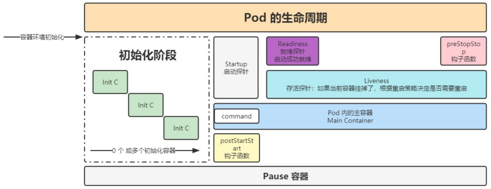

# 深入 Pod

## Pod 配置文件

Pod 是 Kubernetes 中最小的可调度单位，可以包含一个或多个容器。Pod 的配置文件通常采用 YAML 格式，定义了 Pod 的元数据、容器规范、环境变量、卷等信息。

示例 Pod 配置文件：

```yaml
apiVersion: v1
kind: Pod
metadata:
  name: my-pod
spec:
  containers:
  - name: my-container
    image: nginx
    ports:
    - containerPort: 80
```

- **`metadata`**：定义 Pod 的名称、标签、注解等。
- **`spec`**：定义 Pod 中容器的具体规格，包含容器镜像、端口、环境变量、卷等。

## 探针

探针用于监控容器的健康状态，确保容器正常运行。如果某个探针失败，Kubernetes 会采取相应的动作（如重启容器、将其标记为不可用）。

### 类型

- **StartupProbe**：启动探针，用于容器启动时的健康检查。只有容器启动完成后才会启用 LivenessProbe 和 ReadinessProbe。适用于容器启动时间较长的场景。
- **LivenessProbe**：活跃探针，检测容器是否存活。如果探测失败，Kubernetes 会重启该容器。
- **ReadinessProbe**：就绪探针，检测容器是否准备好提供服务。如果探测失败，Kubernetes 会将容器从 Service 的可用列表中移除。

### 探测方式

- ExecAction：通过执行命令来检查容器的健康状态。

  ```yaml
  livenessProbe:
    exec:
      command:
        - cat
        - /tmp/healthy
  ```

- TCPSocketAction：通过 TCP 连接检查容器是否健康。

  ```yaml
  livenessProbe:
    tcpSocket:
      port: 8080
  ```

- HTTPGetAction：通过 HTTP 请求检查容器是否健康。

  ```yaml
  livenessProbe:
    httpGet:
      path: /healthz
      port: 8080
  ```

### 参数配置

- **initialDelaySeconds**：初始延迟时间，探针在容器启动后等待的时间。
- **periodSeconds**：探针的执行周期。
- **timeoutSeconds**：探针的超时时间。
- **successThreshold**：成功响应的连续次数，探针才能认为容器健康。
- **failureThreshold**：失败的连续次数，超过该次数后，Kubernetes 会采取相应的行动（如重启容器）。

```yaml
livenessProbe:
  httpGet:
    path: /healthz
    port: 8080
  initialDelaySeconds: 3
  periodSeconds: 5
  timeoutSeconds: 2
  successThreshold: 1
  failureThreshold: 3
```

## 生命周期



Pod 的生命周期可以分为多个阶段，Kubernetes 会根据 Pod 的生命周期状态来执行相应操作。

### Pod 退出流程

当 Pod 需要退出时或者因策略（如 HPA 伸缩、节点驱逐等）被删除时，Kubernetes 开始终止该 Pod，流程如下：

1. **删除操作**：
   - 删除 Pod 时，Kubernetes 会从 Endpoint 中删除 Pod 的 IP 地址。
   
     - Kubernetes **Service** 通过 Endpoint 维护与 Pod 的映射关系。
     - 在 Pod 进入 **Terminating** 之前，Kubernetes 先从 Endpoint 中删除该 Pod 的 IP 地址，确保新请求不再被调度到该 Pod 上。
     - 这一步骤保证了流量不会继续发送到即将被删除的 Pod，防止请求丢失或异常。
   - Pod 的状态会变成 `Terminating`，表示 Pod 正在终止。
   
     - `kubectl get pod` 会显示 Pod 进入 **Terminating** 状态。
   
     - 在此阶段，Pod 仍然在运行，直到所有终止步骤完成。
   
     - Pod 不会立即被杀死，而是等待完成优雅终止（Graceful Termination）。
   
     - 变为删除中的状态后，会给 pod 一个宽限期，让 pod 去执行一些清理或销毁操作。配置参数：
   
       ```yaml
       # 作用于 pod 中的所有容器
       spec:
         terminationGracePeriodSeconds: 30
       ```
2. **执行 `preStop` 指令**：
   - 在 Pod 被删除之前，Kubernetes 会执行容器中的 `preStop` 指令。这个步骤主要用于进行清理工作，确保 Pod 删除前完成一些必要的操作。
   - `preStop`  可以执行 HTTP 请求或命令：
     - **HTTP 请求**：调用一个 API，通知应用执行清理任务。
     - **命令执行**：运行 Shell 脚本或特定命令，完成资源释放等操作。

```yaml
lifecycle:
  preStop:
    exec:
      command:
        - /bin/sh
        - -c
        - "sleep 5"
```

> `preStop` 可以用来进行数据清理、资源释放等操作。

### PreStop 的应用

`PreStop` 生命周期钩子用于在 Pod 被删除之前执行一些操作，常见的应用场景包括：

- **注册中心下线**：在应用服务退出时，可以通过 `PreStop` 钩子向注册中心（如 Consul、Eureka）发送下线请求，通知其他服务该实例不再可用，避免流量继续发送到已关闭的 Pod。

  - **应用场景**：
    - **微服务架构**（如 Spring Cloud、Dubbo）：Pod 运行的服务通常注册到注册中心（如 Eureka、Consul、Nacos、Zookeeper），需要先下线，避免流量转发到即将终止的实例。
    - **负载均衡（Ingress、Service）**：可主动调用 API，将自身从负载均衡列表移除。

  - **实现方式**：
    - **HTTP 方式**：调用注册中心提供的 API 下线实例。
    - **命令执行**：执行 CLI 命令或脚本取消注册。

  ```yaml
  lifecycle:
    preStop:
      exec:
        command:
          - /bin/sh
          - -c
          - "curl -X POST http://register-center/downline"
  ```

- **数据清理**：执行清理操作，例如删除缓存文件、临时数据等，确保 Pod 被删除时不会留下垃圾数据。

  - **应用场景**：
    - **数据库连接关闭**：防止数据库连接泄漏，确保连接池释放资源。
    - **缓存清理**：从 Redis、Etcd、Consul 等缓存系统删除相关 Key，避免脏数据。
    - **队列任务处理**：确保 Kafka、RabbitMQ、RocketMQ 等消息队列的消费任务正常结束，避免消息丢失或重复消费。

  - **实现方式**：
    - **执行脚本清理数据**
    - **调用 API 通知服务进行清理**

  ```yaml
  lifecycle:
    preStop:
      exec:
        command:
          - /bin/sh
          - -c
          - "rm -rf /tmp/*"
  ```

- **数据销毁**：执行一些必要的销毁操作，防止敏感数据泄露，如删除数据库或文件系统中的敏感信息。

  - **应用场景**：
    - **日志归档**：Pod 终止前，将重要日志转存到对象存储（如 S3、OSS、HDFS）。
    - **临时文件删除**：Pod 可能会在 `/tmp` 或其他挂载目录存放临时文件，需要在退出前清理。
    - **数据库持久化**：部分应用需要在关闭前执行数据持久化（如 Elasticsearch Flush 操作）。

  - **实现方式**：
    - **归档日志**：使用 `tar` 压缩日志，并上传到远程存储。
    - **删除本地临时文件**：执行 `rm -rf /tmp/*` 释放空间。


  ```yaml
  lifecycle:
    preStop:
      exec:
        command:
          - /bin/sh
          - -c
          - "shred -u /path/to/sensitive/data"
  ```


通过 `PreStop` 生命周期钩子，Kubernetes 提供了在 Pod 退出时进行清理和资源释放的能力，有助于保证集群中的健康和安全性。


