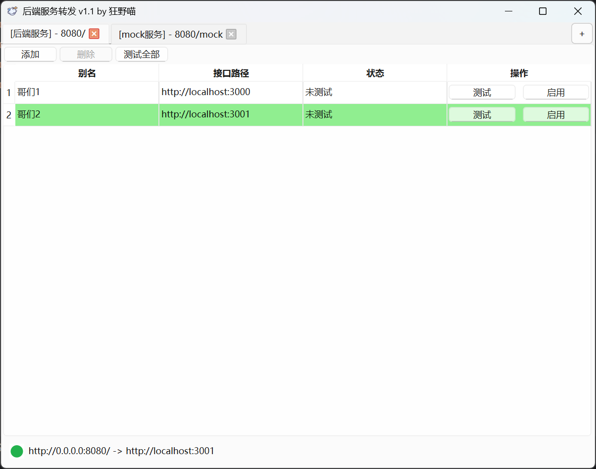
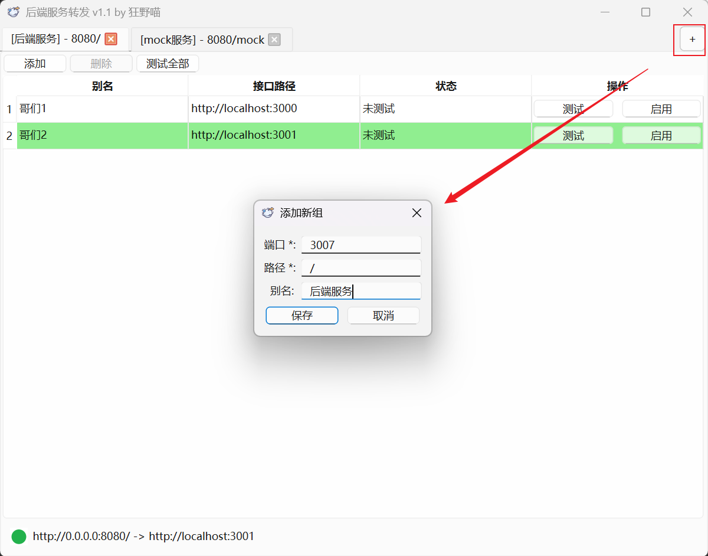
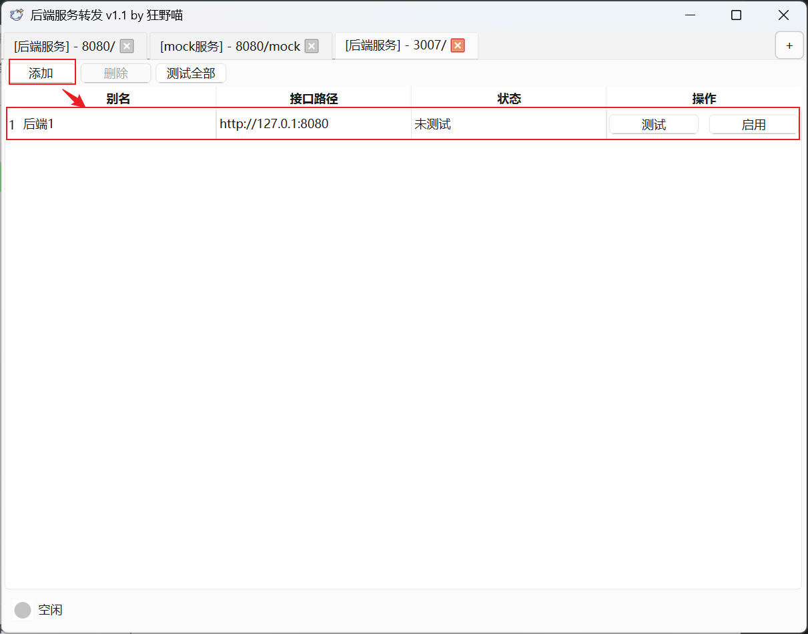

# RequestForward

## 简介
`RequestForward` 是一款请求转发工具，在前端与后端联调的场景中，它能够发挥巨大的作用。借助 `RequestForward`，你可以轻松地将前端发出的请求从一个端点快速转发到不同的后端端点，从而实现不同后端环境的快速切换，为你的开发工作提供了极大的便利。



## 功能特性
- **灵活的请求转发**：支持将 HTTP 请求转发到指定的目标地址。
- **分组管理**：支持对后端端点进行分组，每组可包含多个后端端点。
- **测试功能**：支持对单个或批量后端端点进行可用性测试。

## 安装
### 依赖安装
确保你已经安装了项目所需的依赖。由于本项目使用 `poetry` 来管理依赖，请运行以下命令进行安装：
```shell
pip install poetry
poetry install
```

## 使用

1. 点击右上角的按钮

编写路径以及端口

+ 端口：程序监听的端口
+ 路径：针对指定路径开头的请求进行转发

> 如果所示，程序将监听本地的3007端口，并转发 `uri` 为 `/` 开头的请求



2. 添加



3. 测试

点击测试或者测试全部按钮，即可测试该后端端点的可用性。

4. 启用

点击启用按钮，即可启用该转发规则，所以匹配路径的请求将被转发到该后端端点。

## 许可证
本项目采用 MIT 许可证 。

## 联系我们
如果你有任何问题或建议，请随时联系我们：

- 邮箱： fangqichenchao@163.com
- GitHub： https://github.com/HeMOua/RequestForward
