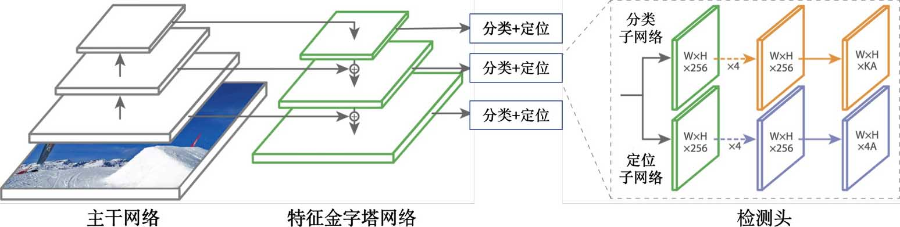

## 目标检测框架结构

目标检测框架的结构主要分为以下三个核心部分：

+ Backbone：主干网络
+ Neck：颈部网络
+ Head：检测头

### Backbone（主干网络）

Backbone是目标检测框架的基础特征提取模块，其核心作用是从输入图像中提取多层次的语义特征。在图像分类任务中，已经证明了 CNN 拥有着很强的特征提取能力，因此我们通常选择 CNN 来处理输入图像。典型的设计包括：

+ 经典 CNN 架构：
  + VGG网络：结构富有规律性，由简单的卷积块堆叠而成，常用的 VGG 网络如 VGG-16。
  + ResNet系列：当下最主流、最受欢迎的网络之一，最常用的比如 ResNet50、ResNet101，ResNet 的核心理念是“残差连接”(residual connection)。
+ 定制化检测网络：
  + DarkNet：一种结合残差连接（Residual Blocks）和跨阶段部分网络（CSP, Cross Stage Partial Network）的定制化卷积神经网络架构，主要包含DarkNet-19和DarkNet-53两个网络。
+ 轻量化设计：
  + 针对工业应用，为了平衡计算效率与精度，设计的轻量级网络架构，比如 MobileNet、EfficientNet、ShuffleNet 网络等

### Neck（特征融合层）

由于主干网络大多从图像分类任务中迁移过来的，它们所提取的特征不一定适合于目标检测任务，因此，在主干网络处理完毕之后，仍有必要去设计一些额外的模块来对其特征做进一步的处理。

这一部分网络我们通常称之为 Neck 颈部网络，Neck 模块负责对不同层级的特征进行融合和增强，以便特征适应目标检测任务，从而解决目标检测中多尺度目标检测的难题。常见技术包括：

+ 特征金字塔网络：FPN（Feature Pyramid Network）认为网络中的不同大小的特征图所包含的信息是不一样的，浅层特征图包含更多的位置信息，且分辨率较高，感受野较小，便于检测小物体，深层特征图包含更多的语义信息，且分辨率较低，感受野较大，便于检测大物体。因此 FPN 通过自上而下的路径融合深层与浅层特征，可以有效地提升网络对不同尺度物体的检测能力。

+ 空间金字塔池化：SPP（Spatial Pyramid Pooling）通过聚合不同尺度的池化结果，以增强网络感受野，从而提升模型性能。

### Head（预测头）

Head 模块基于 Backbone 和 Neck 提取的特征，完成目标定位（Bounding Box回归）和分类任务。根据 Head 的实现方式我们还可以将其分为以下几类：

+ Anchor-Based：如YOLO系列、Faster R-CNN等，通过预设锚框（Anchor）生成候选区域，再回归偏移量。
+ Anchor-Free：如CenterNet、FCOS等，直接预测目标中心点或角点，减少锚框设计的复杂性。
+ Transformer-Based：如DETR，通过查询向量（Query）直接输出预测结果，实现端到端检测。

如下图展示了 RetinaNet 的网络结构，RetinaNet 采用了“解耦”结构的检测头，它由两条并行的分支组成，每一条分支都包含若干层普通卷积、非线性激活函数以及用于最终预测的线性卷积层，属于 Anchor-Based 类的检测头。

