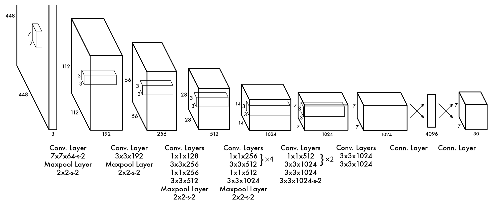

# YOLOv1 详解

作为 One-Stage 流派的开山之祖，YOLOv1 开辟了完全不同于 R-CNN 的新技术路线，虽然从现在来看，存在很多设计缺陷，但正是因为它是这一派系的源头，所以架构最为简单，易于理解。

## YOLOv1 网络结构

整个网络主要包含两个部分：

1. **特征提取网络（Backbone）**：采用一个类似 VGG 的卷积神经网络（CNN）用于提取图像特征。
2. **检测网络（Prediction Head）**：用于直接预测边界框坐标、置信度和类别。

### 输入层

- 输入图像大小：$448 \times 448 \times 3$
- 归一化处理：像素值缩放到 $[−1,1]$

### 卷积层

YOLOv1 采用了 24 层卷积网络（前 20 层是特征提取层），类似于 GoogLeNet 的网络结构，但去掉了 Inception 结构，使用普通的卷积层：

- 前几层使用较小的卷积核（$7\times7, 3\times3$），用于提取低级特征。
- 使用最大池化（$2\times2$）进行下采样。
- 逐步增加通道数，以提取更丰富的特征。

### 全连接层

在最后的卷积层之后，YOLOv1 采用两个全连接层：

- **FC1**：4096 维
- **FC2**：输出层，大小为 $S \times S \times (B \times 5 + C)$

### 输出层

YOLOv1 将输入图像划分为 S×SS \times SS×S 个网格，每个网格：

- 预测 **B**（一般是 2）个边界框，每个框包含：
  - 4 个坐标信息（$x, y, w, h$）
  - 1 个置信度分数（表示该框内有目标的概率）
- 预测 **C** 个类别的分类概率。

因此，最终的输出维度是：
$$
S×S×(B×5+C)
$$
在论文中，$S = 7，B = 2，C = 20$（用于 PASCAL VOC 数据集），所以输出维度是：
$$
7 \times 7 \times (2 \times 5 + 20) = 7 \times 7 \times 30
$$

## YOLOv1 检测原理

## 正样本制作方法

## 搭建 YOLOv1 网络

