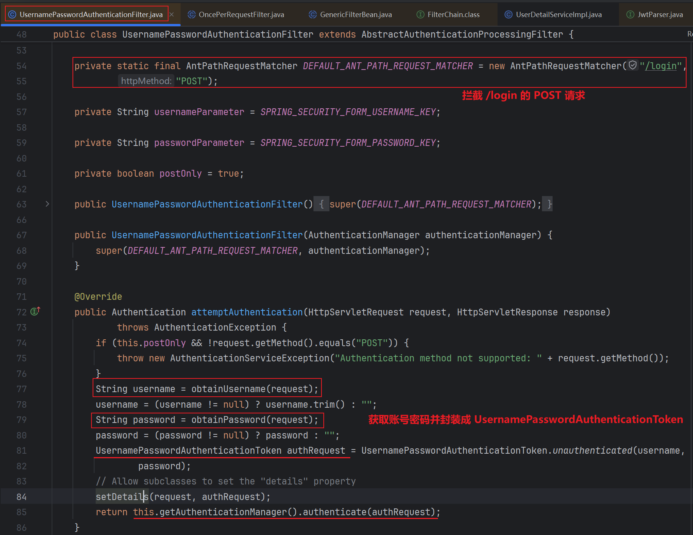
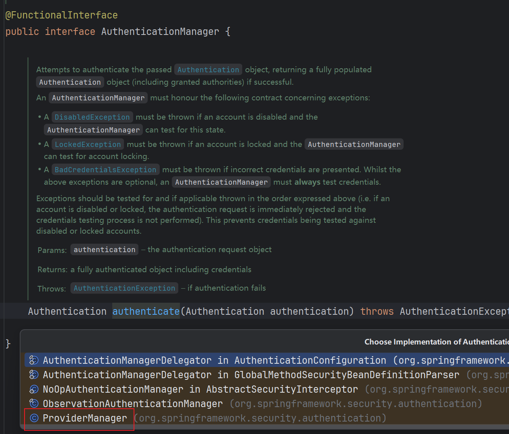
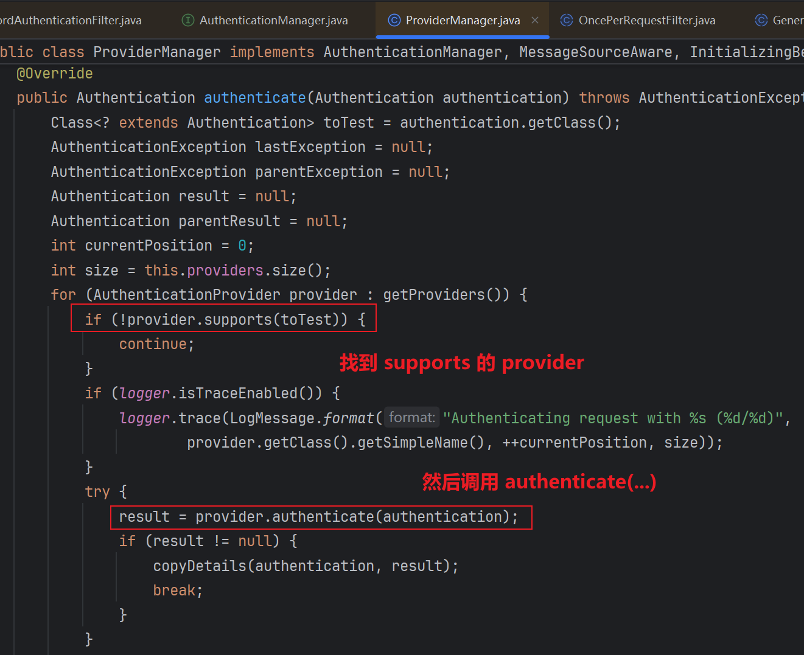
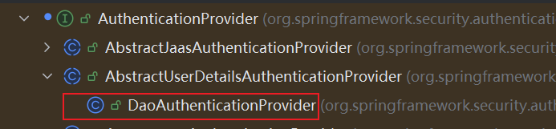
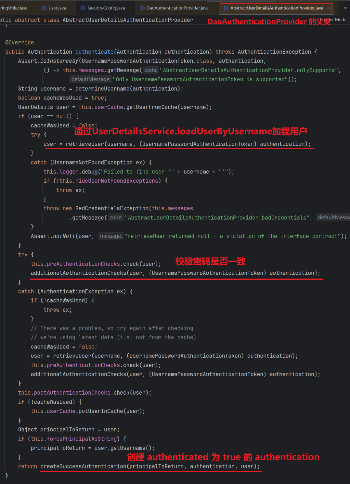
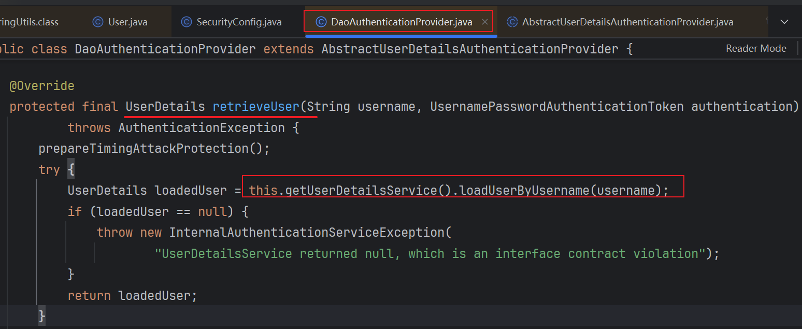
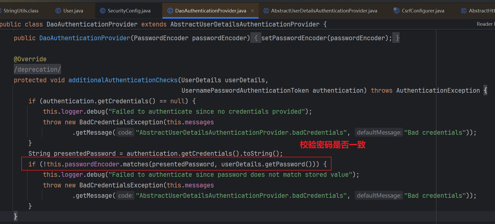
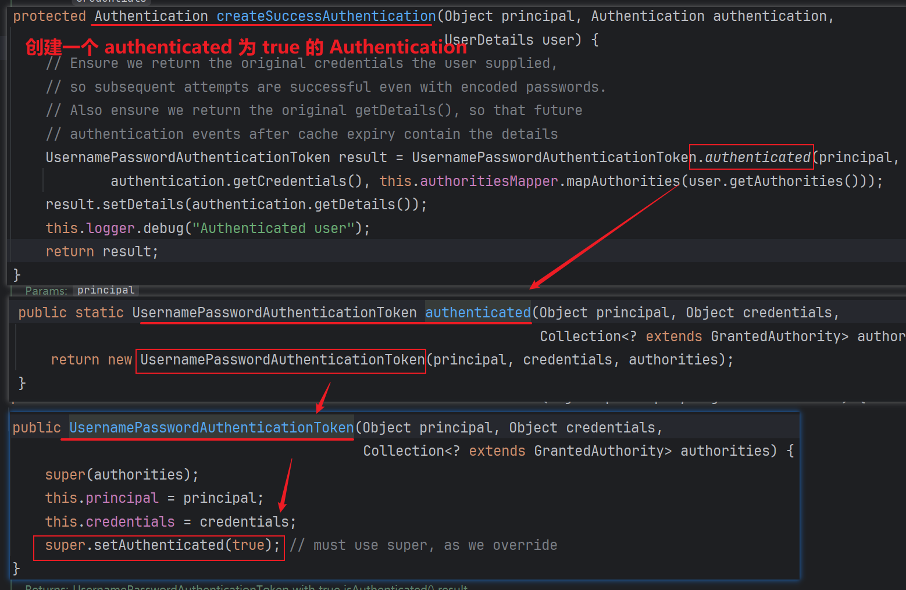
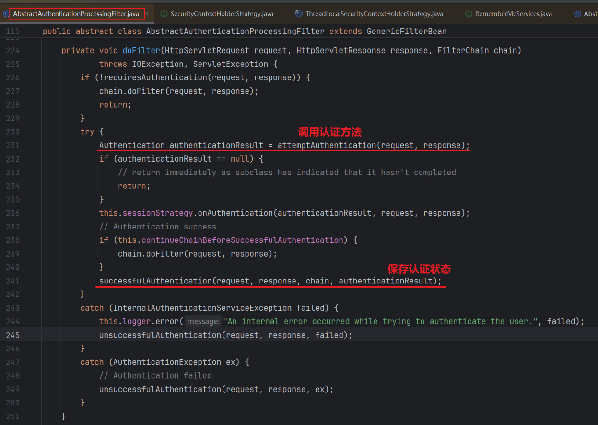
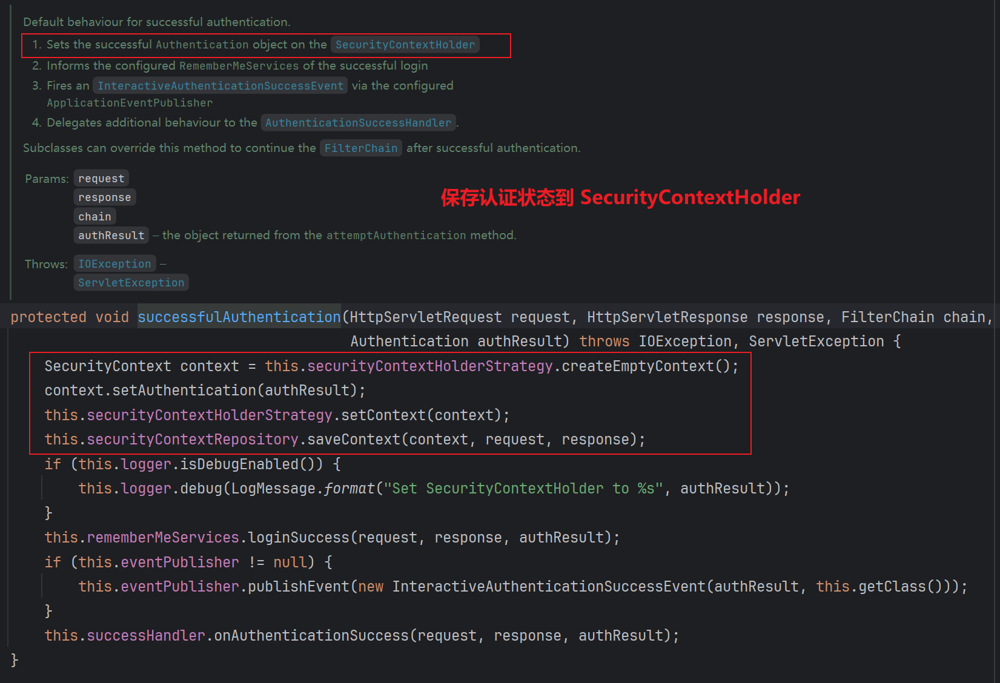

# SpringSecurity 认证流程全解析

## 引言

> Spring Security 是 Spring 全家桶中用于处理安全认证与授权的核心模块。本文将聚焦在“认证流程”的机制解析，帮助你理解从提交用户名密码开始，到登录成功背后到底发生了什么。

## 认证流程详解

### 总体流程总览

Spring Security 的表单认证流程，大致如下图所示：


1. 用户发起登录请求

2. 识别到 `/login` 登录请求，交给 `UsernamePasswordAuthenticationFilter` 过滤器处理

3. 从请求中提取用户名和密码，并封装成 `UsernamePasswordAuthenticationToken`，然后调用 `AuthenticationManager` 的 `authenticate()`  认证方法

4. 调用 `ProviderManager.authenticate()`，它会遍历所有 `supports` 的 `AuthenticationProvider`

5. 默认是 `DaoAuthenticationProvider` ，调用 `authenticate()`

   - 调用 `retrieveUser()` -> `UserDetailsService.loadUserByUsername()`

   - 校验密码：``additionalAuthenticationChecks()``

6. 返回已认证 Authentication 对象，存入 SecurityContextHolder


💡 补充说明：

- 如果你是前后端分离，一般不会使用默认的 `UsernamePasswordAuthenticationFilter`，而是通过自定义登录接口直接调用 `AuthenticationManager.authenticate(...)`。
- 无论是否前后端分离，核心认证流程不变。

### 核心组件作用说明

| 组件名称                               | 作用说明                                                     | 常见实现类 / 接口                                            |
| -------------------------------------- | ------------------------------------------------------------ | ------------------------------------------------------------ |
| `UsernamePasswordAuthenticationFilter` | 拦截表单登录请求，提取用户名密码，生成 `UsernamePasswordAuthenticationToken` | `org.springframework.security.web.authentication.UsernamePasswordAuthenticationFilter` |
| `AuthenticationManager`                | 核心认证管理器，负责调度认证流程                             | `ProviderManager`（默认实现）                                |
| `AuthenticationProvider`               | 实际执行认证逻辑（用户名密码校验）                           | `DaoAuthenticationProvider`（默认实现）                      |
| `UserDetailsService`                   | 加载用户信息（通常从数据库查询）                             | 自定义实现，如 `UserDetailsServiceImpl`                      |
| `UserDetails`                          | 用户对象抽象（包含用户名、密码、权限等）                     | 自定义实现或直接用 `User` 实例                               |
| `SecurityContextHolder`                | 安全上下文存储器，保存当前登录用户的信息                     | 线程安全的 `ThreadLocal` 持久化认证信息                      |

---

### 核心流程解析

#### 请求进入 SpringSecurity 过滤器链

Spring Security 配置了一个 **FilterChainProxy**，它内部有一系列过滤器（Filter），用于处理安全相关的任务：

比如：

- `UsernamePasswordAuthenticationFilter`：处理表单登录认证
- `BasicAuthenticationFilter`：处理 HTTP Basic 认证
- `SecurityContextPersistenceFilter`：从 session 中恢复认证信息
- `ExceptionTranslationFilter`：处理异常和重定向登录页
- `FilterSecurityInterceptor`：最后拦截请求进行授权判断

---

#### 捕获登录请求

当我们提交表单到 `/login`（默认），这个过滤器会执行：

- 从请求中提取用户名和密码
- 封装成 `UsernamePasswordAuthenticationToken`（实现了 `Authentication` 接口）



---

#### 调用 `AuthenticationManager` 进行认证

- `UsernamePasswordAuthenticationFilter` 调用 `AuthenticationManager.authenticate(...)`
- 默认是 `ProviderManager`，它会遍历所有 `AuthenticationProvider`





---

#### 认证提供者 `AuthenticationProvider`



默认使用的是 `DaoAuthenticationProvider`，它会进行如下操作

- 调用 `UserDetailsService.loadUserByUsername(username)` 加载用户
- 比较密码（通过 `PasswordEncoder.matches()`）
- 如果成功，返回一个已认证的 `Authentication` 对象（通常是 `UsernamePasswordAuthenticationToken`，其 `isAuthenticated=true`）









---

#### 认证成功处理

- 将认证成功的 Authentication 对象保存到 `SecurityContextHolder`
- 如果开启了 session，就会将它存入 session，以便后续请求中自动恢复
- 返回登录成功响应（跳转页面或返回 JSON）





#### 之后的请求流程

每次请求：

- 通过 `SecurityContextPersistenceFilter` 从 session 恢复出认证对象
- 由 `FilterSecurityInterceptor` 检查是否有权限访问当前资源

## 动手实战：Spring Security 认证流程配置（前后端分离场景）

### 项目初始化与依赖配置

引入 Maven 依赖：

```xml
<dependency>
    <groupId>org.springframework.boot</groupId>
    <artifactId>spring-boot-starter-security</artifactId>
</dependency>
<dependency>
    <groupId>io.jsonwebtoken</groupId>
    <artifactId>jjwt</artifactId>
    <version>0.9.1</version>
</dependency>
```

项目目录结构：

```
src
 └─main
    ├─java
    │  └─cn
    │     └─springsecuritydemo
    │         │  SpringSecurityDemoApplication.java
    │         │
    │         ├─controller
    │         │      AuthController.java
    │         │
    │         ├─framework
    │         │  ├─config
    │         │  │   SecurityConfig.java
    │         │  │
    │         │  └─security
    │         │      CustomAuthenticationEntryPoint.java
    │         │      JwtAuthenticationFilter.java
    │         │      UserDetailServiceImpl.java
    │         │
    │         ├─model
    │         │      LoginRequest.java
    │         │
    │         └─utils
    │                JwtTokenUtil.java
    │
    └─resources
           application.yaml
```

---

### 自定义用户信息加载逻辑（实现 UserDetailsService）

```java
@Component
public class UserDetailServiceImpl implements UserDetailsService {

    @Override
    public UserDetails loadUserByUsername(String username) throws UsernameNotFoundException {
        // 实际可从数据库中查找用户
        if (!"admin".equals(username)) {
            throw new UsernameNotFoundException("用户不存在");
        }

        // 从数据库中查到的密码，密码应该加密，例：new BCryptPasswordEncoder().encode("123456")
        return new org.springframework.security.core.userdetails.User(
                "admin", "$2a$10$abc...加密后的密码", AuthorityUtils.commaSeparatedStringToAuthorityList("ROLE_USER")
        );
    }
}
```

---

### 自定义登录接口（返回 JWT）

```java
@RestController
@RequestMapping("/auth")
public class AuthController {

    @Resource
    private AuthenticationManager authenticationManager;

    @Resource
    private JwtTokenUtil jwtTokenUtil;

    @PostMapping("/login")
    public ResponseEntity<?> login(@RequestBody LoginRequest request) {
        UsernamePasswordAuthenticationToken token =
                new UsernamePasswordAuthenticationToken(request.getUsername(), request.getPassword());
        try {
            Authentication auth = authenticationManager.authenticate(token);
            String jwt = jwtTokenUtil.generateToken(auth);
            return ResponseEntity.ok(Map.of("token", jwt));
        } catch (AuthenticationException e) {
            return ResponseEntity.status(HttpStatus.UNAUTHORIZED).body("登录失败");
        }
    }
}
```

登录请求体模型

```java
@Data
public class LoginRequest {

    private String username;

    private String password;
}
```

---

### JWT 工具类 + 拦截器（核心）

`JwtTokenUtil.java`（生成 + 校验）

```java
public class JwtTokenUtil {

    private final String secret = "my-secret";
    private final long expiration = 86400000; // 1天

    public String generateToken(Authentication authentication) {
        String username = authentication.getName();
        return Jwts.builder()
                .setSubject(username)
                .setIssuedAt(new Date())
                .setExpiration(new Date(System.currentTimeMillis() + expiration))
                .signWith(SignatureAlgorithm.HS512, secret)
                .compact();
    }

    public String getUsernameFromToken(String token) {
        return Jwts.parser().setSigningKey(secret)
                .parseClaimsJws(token).getBody().getSubject();
    }

    public boolean validateToken(String token) {
        try {
            Jwts.parser().setSigningKey(secret).parseClaimsJws(token);
            return true;
        } catch (JwtException e) {
            return false;
        }
    }
}
```

`JwtAuthenticationFilter.java`（认证过滤器）

```java
@Component
public class JwtAuthenticationFilter extends OncePerRequestFilter {

    @Resource
    private JwtTokenUtil jwtTokenUtil;

    @Resource
    private UserDetailsService userDetailsService;

    @Override
    protected void doFilterInternal(HttpServletRequest request, HttpServletResponse response, FilterChain filterChain) throws ServletException, IOException {
        String token = request.getHeader("Authorization");
        if (token != null && token.startsWith("Bearer ")) {
            token = token.substring(7); // 移除前缀
            String username = jwtTokenUtil.getUsernameFromToken(token);

            if (username != null && SecurityContextHolder.getContext().getAuthentication() == null) {
                UserDetails userDetails = userDetailsService.loadUserByUsername(username);
                if (jwtTokenUtil.validateToken(token)) {
                    UsernamePasswordAuthenticationToken authToken =
                            new UsernamePasswordAuthenticationToken(userDetails, null, userDetails.getAuthorities());
                    authToken.setDetails(new WebAuthenticationDetailsSource().buildDetails(request));
                    SecurityContextHolder.getContext().setAuthentication(authToken);
                }
            }
        }

        filterChain.doFilter(request, response);
    }
}
```

---

### SecurityConfig 配置类

```java
@Configuration
@EnableWebSecurity
public class SecurityConfig {

    @Resource
    private JwtAuthenticationFilter jwtAuthenticationFilter;

    @Resource
    private UserDetailsService userDetailsService;

    @Resource
    private CustomAuthenticationEntryPoint unauthorizedHandler;

    @Bean
    public AuthenticationManager authenticationManager(HttpSecurity http, PasswordEncoder encoder) throws Exception {
        DaoAuthenticationProvider provider = new DaoAuthenticationProvider();
        provider.setUserDetailsService(userDetailsService);
        provider.setPasswordEncoder(encoder);
        return new ProviderManager(provider);
    }

    @Bean
    public PasswordEncoder passwordEncoder() {
        return new BCryptPasswordEncoder(); // 用于加密密码
    }

    @Bean
    public SecurityFilterChain filterChain(HttpSecurity http) throws Exception {
        return http
                // CSRF禁用，因为不使用session
                .csrf(CsrfConfigurer::disable)
                // 基于token，所以不需要session
                .sessionManagement(session -> session.sessionCreationPolicy(SessionCreationPolicy.STATELESS))
                // 标记允许匿名访问的url
                .authorizeHttpRequests(auth -> auth
                        .requestMatchers("/auth/login").permitAll()
                        .anyRequest().authenticated()
                )
                .exceptionHandling(exception -> exception.authenticationEntryPoint(unauthorizedHandler))
                // 添加JWT filter
                .addFilterBefore(jwtAuthenticationFilter, UsernamePasswordAuthenticationFilter.class)
                .build();
    }
}
```

自定义异常返回（认证失败）

```java
@Component
public class CustomAuthenticationEntryPoint implements AuthenticationEntryPoint {
    @Override
    public void commence(HttpServletRequest request, HttpServletResponse response, AuthenticationException authException) throws IOException, ServletException {
        response.setContentType("application/json");
        response.setStatus(HttpServletResponse.SC_UNAUTHORIZED);
        response.getWriter().write("{\"error\": \"未认证，请登录\"}");
    }
}
```

---

###  最终效果

- `POST /auth/login` 用于登录，前端提供 `username + password`，后端返回 JWT。
- 前端将 `token` 存入 localStorage 或 Cookie，在后续请求中通过 `Authorization: Bearer <token>` 传递。
- 所有请求默认都需认证（除了在 `.requestMatchers()` 中放行的地址）。

## 总结与延伸

Spring Security 的认证流程虽然由多个组件协作完成，但核心逻辑清晰：

> **识别请求 → 委托认证 → 加载用户 → 校验密码 → 保存状态**

---

### 自定义登录的扩展点

- 替换 `UserDetailsService` → 连接数据库、Redis、LDAP 等
- 自定义 `AuthenticationProvider` → 实现手机验证码、OAuth2 等认证方式

